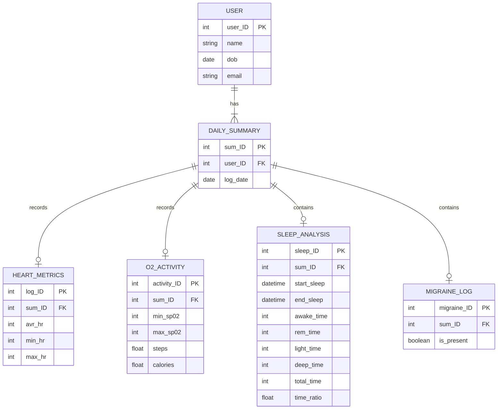

# Migraine and Health Metrics Database

**Author:** Kate Macias  
**Course:** Databases, Winter 2026

A relational database design that links a user's daily health metrics (heart rate, blood oxygen and activity, sleep) to whether they had a migraine that day. The data can then be queried for patterns that come before a migraine.

## Running the Project

The project is a SQLite database (`migrainehealthmetrics.db`) with a small PHP web page (`UserInterface.php`) for running SQL queries against it.

### Requirements

- PHP 8 or later with the `pdo_sqlite` extension (Homebrew's PHP includes it)
- macOS no longer comes with PHP, so install it first:
- Windows users use pip

```bash
brew install php
php -v                      # confirm it's installed
php -m | grep pdo_sqlite    # confirm SQLite support
```

### Launch

1. Clone the repository:
   ```bash
   git clone https://github.com/kemacias/Migraine_Health_Metrics_Database.git
   cd Migraine_Health_Metrics_Database
   ```
   - make sure you're in the Migraine_Health_Metrics-Database directory.
     
2. Start PHP's built-in web server from the project folder:
   ```bash
   php -S localhost:8000
   ```
3. Open http://localhost:8000/UserInterface.php in your browser.
4. Paste a query into the box (examples are in `quieries.txt`) and click **Run SQL**. Results appear as a table below the box.
5. Press `Ctrl + C` in the terminal to stop the server.

### Querying without the web page

You can also open the database directly with the SQLite command line tool (included with macOS):

```bash
sqlite3 migrainehealthmetrics.db
sqlite> .tables
sqlite> .mode box
sqlite> SELECT * FROM user;
sqlite> .quit
```

> **Note:** The web page runs any SQL typed into it, including `DELETE` and `DROP`. It's meant for local use only; don't host it publicly.

## Entity-Relationship Diagram



> Column names and types match the SQLite schema in `migrainehealthmetrics.db`.

## Entities

### `user`
Stores each person being tracked.

| Attribute | Key | Description |
|-----------|-----|-------------|
| `user_ID` | PK | Unique user identifier |
| `name` | | User's name |
| `dob` | | Date of birth |
| `email` | | Contact email |

### `daily_summary`
The central table. There is one row per user per day, and every metric table links back to it.

| Attribute | Key | Description |
|-----------|-----|-------------|
| `sum_ID` | PK | Unique daily summary identifier |
| `user_ID` | FK → `user` | User this day belongs to |
| `log_date` | | Calendar date of the summary |

### `heart_metrics`
Heart rate stats for the day.

| Attribute | Key | Description |
|-----------|-----|-------------|
| `log_ID` | PK | Unique heart log identifier |
| `sum_ID` | FK → `daily_summary` | Associated day |
| `avr_hr` | | Average heart rate |
| `min_hr` | | Minimum heart rate |
| `max_hr` | | Maximum heart rate |

### `o2_activity`
Blood oxygen and activity for the day.

| Attribute | Key | Description |
|-----------|-----|-------------|
| `activity_ID` | PK | Unique activity identifier |
| `sum_ID` | FK → `daily_summary` | Associated day |
| `min_sp02` | | Minimum blood oxygen saturation |
| `max_sp02` | | Maximum blood oxygen saturation |
| `steps` | | Step count |
| `calories` | | Calories burned |

### `sleep_analysis`
Sleep timing and sleep-stage breakdown for the night.

| Attribute | Key | Description |
|-----------|-----|-------------|
| `sleep_ID` | PK | Unique sleep record identifier |
| `sum_ID` | FK → `daily_summary` | Associated day |
| `start_sleep` | | Time sleep began |
| `end_sleep` | | Time sleep ended |
| `awake_time` | | Minutes spent awake |
| `rem_time` | | Minutes of REM sleep |
| `light_time` | | Minutes of light sleep |
| `deep_time` | | Minutes of deep sleep |
| `total_time` | | Total minutes across all sleep stages |
| `time_ratio` | | Ratio of time asleep to time in bed |

### `migraine_log`
Records whether a migraine happened that day.

| Attribute | Key | Description |
|-----------|-----|-------------|
| `migraine_ID` | PK | Unique migraine record identifier |
| `sum_ID` | FK → `daily_summary` | Associated day |
| `is_present` | | Whether a migraine occurred |

## Relationships

| Relationship | Entities | Cardinality | Notes |
|--------------|----------|-------------|-------|
| **has** | `user` → `daily_summary` | 1 : N | Total participation. Every daily summary belongs to exactly one user. |
| **records** | `daily_summary` → `heart_metrics` | 1 : 1 | One heart metrics record per day |
| **records** | `daily_summary` → `o2_activity` | 1 : 1 | One O2/activity record per day |
| **contains** | `daily_summary` → `sleep_analysis` | 1 : 1 | One sleep record per day |
| **contains** | `daily_summary` → `migraine_log` | 1 : 1 | One migraine entry per day |

## Design Notes

- **Hub-and-spoke schema:** `daily_summary` sits at the center, so any metric can be joined to migraine outcomes by `sum_ID`.
- **Separate metric tables:** each data source lives in its own table, so a day with missing sleep or activity data doesn't leave nulls across a single wide table.


